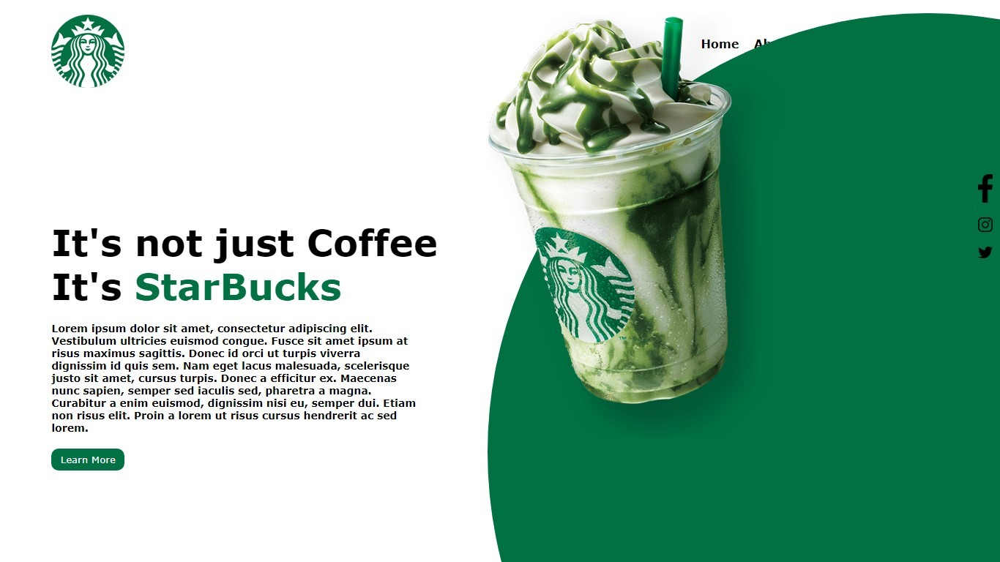

<h1 align="center">.:| Clone Starbucks |:.</h1>

 

<h2 align="center">📖Descrição</h2>

Clone do index do Starbucks desenvolvido no curso Front End completo da Danki Code, com as tecnologias html5 e CSS3 focado na utilzação das propriedades flexbox, totalmente responsivo.

 

<h2 align="center">🖥Preview</h2>
</img>

 

<h2 align="center">🛠 Tecnologias</h2>

- [HTML5](https://html.com/)
- [CSS3](https://developer.mozilla.org/pt-BR/docs/Web/CSS)

 

<h2 align="center">⚡️ Demonstração</h2>

Para testar o projeto, basta baixar o <a href="https://github.com/KevynFirst/fblogin-clone-float/archive/refs/heads/main.zip">arquivo</a> e extrai-lo 

Abra a pasta de extração e execute o arquivo index.html 

 

<h2 align="center">Obrigado por visitar meu projeto 😉</h2>

Você pode conferir outros projetos que desenvolvi aqui no meu GitHub, ou entrar em contato comigo pelos demais links.

